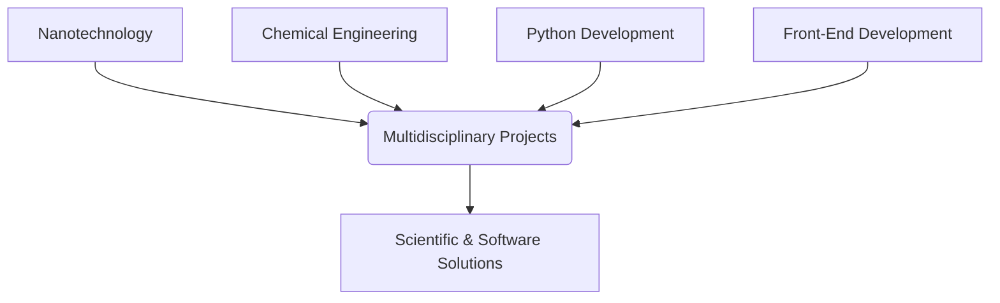

<!-- Hero Logo -->

  

<!-- Animated Header -->

  

---

# 🌟 About Me

I’m a **multidisciplinary engineer** who combines **nanotechnology research**, **chemical engineering knowledge**, and **software development skills** to build meaningful scientific and digital solutions.

### 💡 What I Do:
- 🧪 **Nanocoatings & evaporation control research**
- ⚗️ **Nanocomposites & surface engineering**
- 🧰 **Python developer (data, automation, analysis)**
- 🎨 **Front-end developer (React + Tailwind)**
- 🧬 Integrating coding with experimental engineering

---

# 🛠️ Tech Stack

### 💻 Development

  

### 🔬 Engineering & Research Tools

  
  <!-- Aspen HYSYS custom icon -->
  

---

# 🧬 Research Interests
- Evaporation reduction technologies  
- Hydrophobic & nanostructured coatings  
- Python-based scientific modeling  
- Experimental design & sensor systems  

---

# ⚡ Highlights & Badges

  
  
  
  

<!--
---
# 📁 Featured Projects (Animated Cards)

  Card 1
  
  Card 2
  

  <Card 3
  

-->
---

# 📊 GitHub Activity

  

  

  

---

# 🧬 Animated Skills Overview

---

# 🏢 My Organization

  <!-- لینک به Organization -->
    <a aria-label="PyRezaSeyyednezhad" itemprop="follows" class="avatar-group-item" data-hovercard-type="organization" data-hovercard-url="/orgs/PyRezaSeyyednezhad/hovercard" data-octo-click="hovercard-link-click" data-octo-      dimensions="link_type:self" data-hydro-click="{&quot;event_type&quot;:&quot;user_profile.click&quot;,&quot;payload&quot;:{&quot;profile_user_id&quot;:100033031,&quot;target&quot;:&quot;MEMBER_ORGANIZATION_AVATAR&quot;,&quot;user_id&quot;:100033031,&quot;originating_url&quot;:&quot;https://github.com/Reza-Seyyednezhad&quot;}}" data-hydro-click-hmac="e3b87a6784096d3545a5e3f21a8497a48a5c69524d7929596a6b9ab210b98206" href="/PyRezaSeyyednezhad" aria-keyshortcuts="Alt+ArrowUp">
        
  </a>
  <a aria-label="WebRezaSeyyednezhad" itemprop="follows" class="avatar-group-item" data-hovercard-type="organization" data-hovercard-url="/orgs/WebRezaSeyyednezhad/hovercard" data-octo-click="hovercard-link-click" data-octo-dimensions="link_type:self" data-hydro-click="{&quot;event_type&quot;:&quot;user_profile.click&quot;,&quot;payload&quot;:{&quot;profile_user_id&quot;:100033031,&quot;target&quot;:&quot;MEMBER_ORGANIZATION_AVATAR&quot;,&quot;user_id&quot;:100033031,&quot;originating_url&quot;:&quot;https://github.com/Reza-Seyyednezhad&quot;}}" data-hydro-click-hmac="e3b87a6784096d3545a5e3f21a8497a48a5c69524d7929596a6b9ab210b98206" href="/WebRezaSeyyednezhad" aria-keyshortcuts="Alt+ArrowUp">
      
</a>

---
# 📄 Mini-Resume

### 🎓 Education
- **MSc. Nanotechnology — Chemical Engineering**

### 🧑‍🔧 Skills
- Python, React, Tailwind, Git  
- Scientific modeling (MATLAB, Python)  
- Experimental design  
- Data analysis & visualization  

### 🎯 Goals
- Publish research in nanotechnology  
- Build open-source engineering tools  
- Become expert in nano–digital integration  

### 🤝 Connect With Me

  
  
  

  

